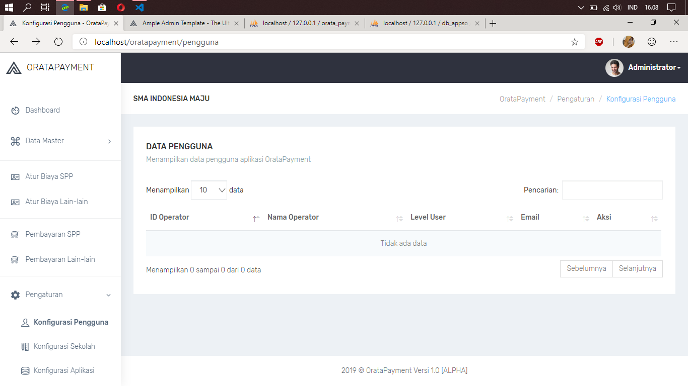

  <a href="#">
    
		<h1 align="center">OrataPayment</h1>
  </a>

  OrataPayment adalah Aplikasi pembayaran sekolah online, build with Code Igniter and ajax. 

Aplikasi ini di buat oleh mahasiswa semester akhir D2 Program Studi Teknik Informatika Politeknik Negeri Bandung.

	Project Status : <a href="https://github.com/oratakashi/OrataPayment/commits/master">Work in Progress</a>

<h1></h1>
 

## License
OrataPayment is under the [MIT License](LICENSE)

## Supported 

  

## Author
Name           | Job
-------------:|:-------------------------
Oratakashi Nhamako     | Full Stack Developer
